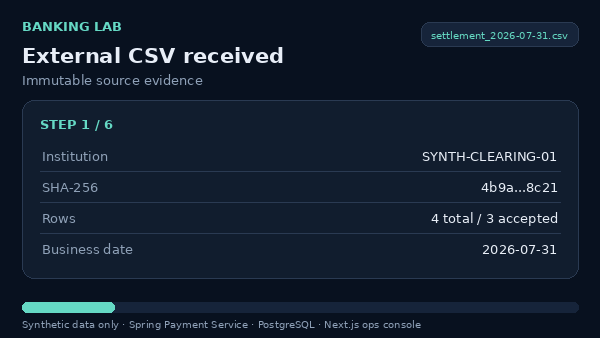
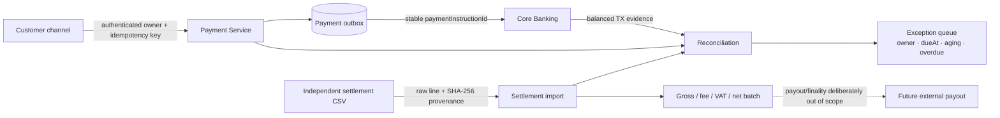
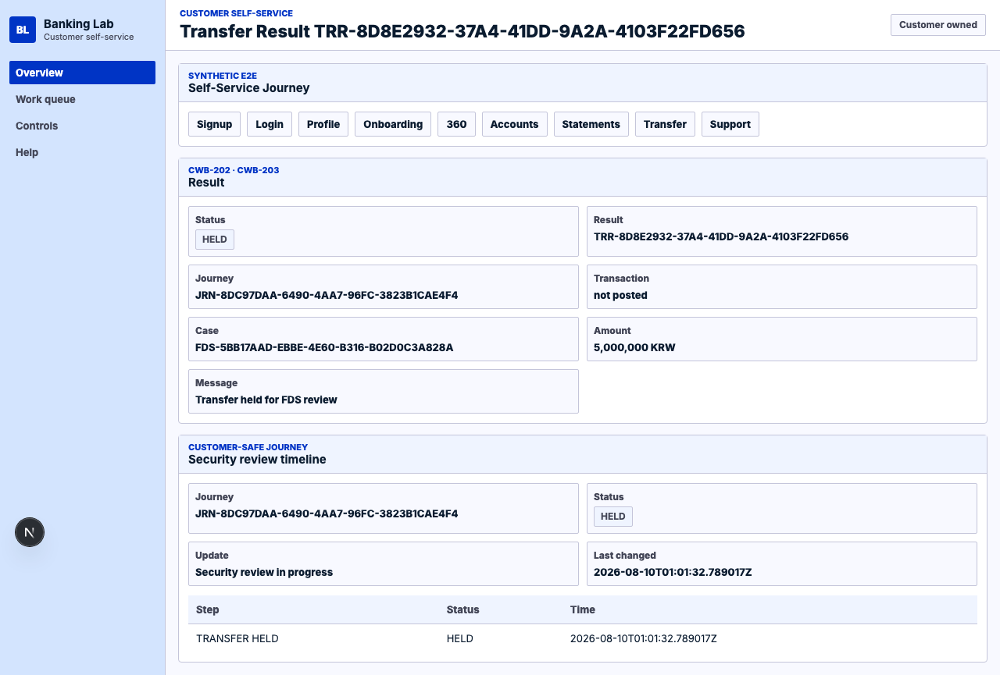

# Payment Settlement & Ledger Reliability Lab

A Kotlin/Spring and Next.js portfolio that shows how a synthetic payment request becomes a balanced ledger transaction, an independently sourced settlement position, and an owner-managed reconciliation exception without confusing internal posting with external settlement finality.

[](https://github.com/kdh949/banking-lab/actions/workflows/portfolio-gate.yml)
[](https://github.com/kdh949/banking-lab/actions/workflows/ci.yml)



The GIF is a guided synthetic fixture walkthrough of the same operations screen used in API mode. When `NEXT_PUBLIC_BANKING_PAYMENT_API_BASE_URL` and the explicit local simulator-token opt-in are configured, the screen calls the Spring Payment Service contracts directly.

## The problem this slice solves

A payment system can report success while its internal instruction, double-entry ledger, and independently received clearing file disagree. This slice keeps those sources separate and makes disagreement operationally visible:

```text
Authenticated payment request
→ idempotent instruction and durable outbox
→ balanced BILL_PAYMENT ledger posting
→ independent external settlement CSV import
→ biller position: gross - fee - VAT + adjustment = net
→ payment · ledger · external 3-way reconciliation
→ exception owner, SLA, aging, and audited read
```

Internal `LEDGER_POSTED` means that Core Banking accepted a balanced synthetic ledger transaction. `INCLUDED_IN_BATCH` means that accepted external lines were calculated into a payout position. Neither state claims that an external institution moved money or that settlement finality was reached.

## Architecture in one view



The Payment Service never reads Core Banking ledger tables directly for 3-way reconciliation. It uses a reason-required read API, releases the local transaction before the remote call, and then finalizes the run in a second local transaction. The independent external CSV is stored with its source metadata, SHA-256 digest, line number, and raw line.

## What to inspect in three minutes

| Question | Implementation | Executable evidence |
|---|---|---|
| Can an unbalanced financial transaction commit? | [Ledger command and PostgreSQL integrity controls](services/core-banking/src/main/kotlin/lab/banking/core/ledger) | [LedgerDatabaseIntegrityIntegrationTest](services/core-banking/src/integrationTest/kotlin/lab/banking/core/ledger/application/LedgerDatabaseIntegrityIntegrationTest.kt) |
| Is internal posting separated from external settlement? | [`LEDGER_POSTED` semantics](docs/architecture/payment-ledger-posted-semantics.md) | [`paymentLedgerPostedSemantics.test.mjs`](tests/paymentLedgerPostedSemantics.test.mjs) |
| Is the clearing source independent and reproducible? | [Settlement import and batch calculation](services/payment-service/src/main/kotlin/lab/banking/payment/settlement) | [PaymentSettlementIntegrationTest](services/payment-service/src/integrationTest/kotlin/lab/banking/payment/PaymentSettlementIntegrationTest.kt) |
| Are payment, ledger, and external evidence compared? | [3-way reconciliation service](services/payment-service/src/main/kotlin/lab/banking/payment/reconciliation) | [PaymentReconciliationIntegrationTest](services/payment-service/src/integrationTest/kotlin/lab/banking/payment/PaymentReconciliationIntegrationTest.kt) |
| Can an operator see provenance, net position, and SLA exceptions? | [Ops settlement workbench](apps/ops-console/src/components/PaymentSettlementWorkbench.tsx) | [Settlement Playwright scenario](apps/ops-console/e2e/settlement-operations.spec.ts) |
| Are customer commands bound to the authenticated owner? | [Ownership boundary](docs/security/payment-customer-ownership.md) | [`paymentCustomerOwnership.test.mjs`](tests/paymentCustomerOwnership.test.mjs) |

## Operations workbench

The first ops-console panel is a single four-stage walkthrough:

1. **CSV provenance** — original filename, institution, business date, byte count, SHA-256, accepted/rejected counts, and immutable raw-line boundary.
2. **Settlement position** — biller, currency, value date, gross, fee, VAT, adjustment, net, and `INCLUDED_IN_BATCH` status.
3. **3-way result** — payment instruction, balanced ledger transaction, external line, and deterministic mismatch taxonomy.
4. **Exception queue** — owner, detected time, due time, aging days, overdue status, and reason-audited reads.

The API-backed mode uses the exported client methods below rather than ad-hoc `fetch` calls:

```text
POST /api/payments/settlement/imports
GET  /api/payments/settlement/imports/{importId}
POST /api/payments/settlement/batch-runs
GET  /api/payments/settlement/batch-runs/{batchRunId}
POST /api/payments/reconciliation/runs
GET  /api/payments/reconciliation/runs/{runId}
GET  /api/payments/reconciliation/exceptions
```

The reusable TypeScript contract is in [`packages/api-client/src/payment-settlement.ts`](packages/api-client/src/payment-settlement.ts).

## Supporting Channel Playground

The settlement and ledger slice above remains the primary portfolio story. A supporting synthetic [cross-channel held-transfer workbench](docs/product/channel-workbench.md) follows one high-value, first-beneficiary transfer through customer `HELD` status, a reason-gated and masked call-center handoff, FDS201 maker review, APR101 independent approval, exactly-once balanced posting or a zero-ledger block, and customer notification—all under one `journeyId`.



Run its disposable Spring/PostgreSQL/Redpanda/Next.js proof with:

```bash
npm run demo:test:channels
```

The command resets local synthetic state, starts the bounded services, runs the separated customer/agent/FDS-maker/checker browser and API journey, verifies ledger and audit invariants in PostgreSQL, records evidence, and cleans up. See the [90–120 second walkthrough](docs/demo-scenarios/cross-channel-held-transfer-demo.md) and [latest local evidence](docs/test-evidence/generated/cross-channel-held-transfer-demo.json). It does not claim external payment or settlement finality.

## Reproduce the portfolio gate

Prerequisites:

- Node.js 24 and npm 10.9.2
- JDK 21
- Docker for PostgreSQL Testcontainers
- Chromium installed through Playwright

```bash
nvm use
npm ci
npm run portfolio:verify
```

The command is intentionally divided so each boundary can be reviewed independently:

```bash
npm run portfolio:verify:node     # domain/repository gates, contracts, TypeScript packages
npm run portfolio:verify:backend  # core ledger and payment settlement integration tests
npm run portfolio:verify:web      # ops-console build and focused Playwright walkthrough
```

For the lightweight repository and contract slice without Docker or a browser:

```bash
npm run portfolio:verify:node
```

## Failure and control cases

The representative tests cover more than happy-path CRUD:

- the same payment idempotency key converges on one business result;
- a customer cannot use a body-supplied identity to operate another customer's account or payment;
- an unbalanced or single-sided ledger transaction is rejected at the database boundary;
- an external file retains independent provenance and duplicate-file protection;
- rejected or returned external lines do not enter the payout position;
- amount, status, source-presence, duplicate, value-date, and late-settlement mismatches are classified deterministically;
- a failed Core Banking evidence call leaves a retryable reconciliation run instead of holding a remote call inside a Payment DB transaction;
- privileged run and exception reads require a reason and create audit evidence.

Detailed decisions:

- [Payment settlement foundation](docs/architecture/payment-settlement-foundation.md)
- [Payment three-way reconciliation](docs/architecture/payment-three-way-reconciliation.md)
- [Ledger integrity evidence](docs/test-evidence/hardening-h3-ledger-db-integrity.md)
- [Formal ledger model](docs/formal/ledger-model.md)

## CI boundaries

CI is defined as two explicit workflows:

- **Portfolio gate** runs for pull requests and validates the focused Node/contracts slice, the core-ledger/payment integration slice, the ops-console build, and the CSV-to-exception Playwright scenario.
- **Full validation** runs after a push to `main`, on a nightly schedule, or manually. It retains the complete eight-app Next.js matrix, all four Spring service suites, platform and contract validation, Compose rendering, broad Playwright, security evidence, and the formal ledger model.

Both workflows pin Node 24. Local runtime declarations are pinned through `package.json`, `.nvmrc`, and `.node-version` so local and hosted checks do not silently use different Node major versions.

## Technology map

```text
services/core-banking       Kotlin / Spring Boot / PostgreSQL ledger and controls
services/payment-service    Kotlin / Spring Boot payment, settlement, and reconciliation
apps/ops-console            Next.js settlement operations workbench
packages/api-client         Typed TypeScript API client contracts
contracts                   OpenAPI, AsyncAPI, and event schemas
db/migrations               Flyway schemas and database invariants
formal                      TLA+ ledger and idempotency model
docs                        ADRs, evidence, drills, and the full lab overview
```

The broader repository also contains customer, staff, complaint, call-center, AML/FDS, audit, admin, notification, and reporting scopes. Read [the full banking lab overview](docs/full-lab-overview.md) for that platform breadth; it is intentionally secondary to this portfolio vertical slice.

## Evidence discipline and limits

All data is synthetic. The project uses no real deposits, transfers, payment networks, customer records, credentials, or external financial-institution APIs, and it contains no real customer PII.

“Bank-grade controls” in the extended documentation refers only to the implemented control properties—balanced double-entry postings, append-only audit, reason-required access, maker-checker, idempotency, and evidence—not to production certification or a complete bank platform.

The Node runtime remains an in-memory archived reference/oracle path only. Target implementation paths are Kotlin/Spring Boot, TypeScript/Next.js, PostgreSQL/Flyway, and the associated platform assets.

The current manifest catalog contains 73 synthetic screens. The staff terminal retains a bounded Spring API evidence panel rather than restoring the retired broad manifest route set. A skipped env-gated Playwright smoke is not counted as a live API pass. Before a demonstration or evidence refresh, rerun the call-center live synthetic API/Keycloak browser wrapper and the focused settlement Playwright gate.

Current source-generation coverage and other hardening limits remain documented in the [full overview](docs/full-lab-overview.md), the [implementation coverage matrix](docs/implementation-coverage-matrix.md), and the checked-in evidence reports. In particular, future contract hardening should extend springdoc/Jackson DTO schema generation beyond the core-banking ledger command, inquiry, and case workflow subsets plus payment-service, notification-service, and reporting-service.
